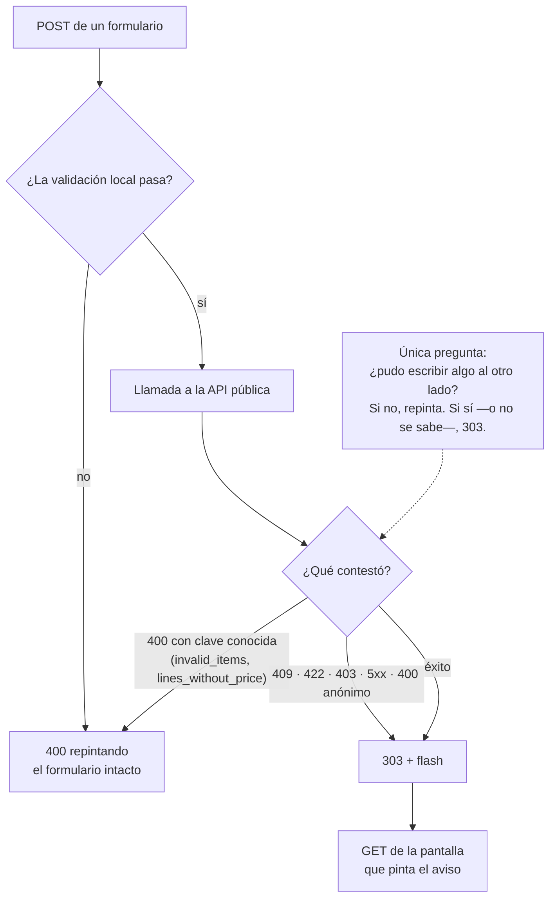

# Arquitectura de `wapp-client-console`

Cómo está hecha por dentro. Todo lo de aquí está verificado sobre el árbol en `ac906e2` (2026-08-30).

---

## 1 · Las tres capas, y lo que cada una tiene prohibido

| Capa | Paquete | Qué hace | Qué NO puede hacer |
|---|---|---|---|
| Arranque | `cmd/client-console`, `internal/bootstrap`, `internal/config` | leer entorno, montar `slog`, levantar el `http.Server` endurecido y drenarlo al recibir señal | conocer una ruta, una pantalla o un endpoint |
| Web | `internal/web` | el router, la cadena de middleware, los handlers, las plantillas embebidas y el catálogo de textos | hablar con un upstream directamente (siempre vía `internal/apiclient`) |
| Cliente HTTP | `internal/apiclient` | traducir cada operación de negocio a una llamada de la API pública y su desenlace a un **sentinela** | pintar HTML, saber qué es una cookie, aceptar un `tenantID` (salvo la excepción de INV-04) |

**No hay capa de dominio ni de persistencia**, y es correcto: el dominio vive en la plataforma. Esta
pieza es superficie.

---

## 2 · Mapa de paquetes

```
cmd/client-console/        main.go (32 líneas, `wc -l`): config → slog → bootstrap.Run
internal/bootstrap/        http.Server con los cuatro timeouts + apagado ordenado (SIGINT/SIGTERM)
internal/config/           las 21 variables WAPP_* y los tres plazos derivados de la sugerencia
internal/apiclient/        14 ficheros de producción · 9 clientes de dominio sobre 1 Transport
internal/web/              29 ficheros de producción · el router, 44 rutas, los handlers, el flash
internal/web/templates/    layouts/base.html · 14 páginas · 5 parciales (embebidas con //go:embed)
internal/web/static/css/   app.css (439 líneas); las otras tres hojas vienen de wapp-shared/ui
```

**`internal/web` es el núcleo** (54 ficheros `.go` contando tests, 272 funciones `Test*`). Los
ficheros grandes, por tamaño: `flash.go` (1.297 líneas, el vocabulario entero),
`catalogo_handler.go` (766), `solicitudes_lineas.go` (627), `editor_handler.go` (501),
`solicitudes_comparacion.go` (473), `solicitudes_acciones.go` (456), `server.go` (414).

**`internal/apiclient` es el segundo núcleo.** `Client` (`internal/apiclient/client.go:21-42`)
agrupa **nueve** clientes de dominio —`Members`, `Roles`, `Entitlements`, `Sessions`,
`Invitations`, `Editor`, `Intakes`, `Tenants`, `Catalog`— sobre **un solo `Transport`** con **dos**
`http.Client` (`internal/apiclient/transport.go:145-169`):

- `http` — el general, con el plazo de la config (20 s en UAT, 15 s de suelo).
- `inference` — **solo para la sugerencia de cotización**, `DefaultInferenceTimeout = 55 s`
  (`internal/apiclient/transport.go:49`). Existe porque `http.Client.Timeout` **no se puede
  sobrescribir por petición**; comparte el pool de conexiones, lo que cambia es el plazo.

---

## 3 · Punto de entrada y binario

**Uno solo.** `cmd/client-console/main.go` → binario **`client-console`** (así lo ignora
`.gitignore:9`). En UAT se instala como `/usr/local/bin/wapp-client-console` y corre bajo la unidad
`wapp-client-console.service`.

- `main` (`cmd/client-console/main.go:12-30`): `config.Load()`; `slog` **Text+Debug** si
  `WAPP_CONSOLE_ENV=local` y **JSON+Info** en cualquier otro caso; traza el arranque; llama a
  `bootstrap.Run`.
- `bootstrap.Run` (`internal/bootstrap/server.go:17-22`) instala
  `signal.NotifyContext(SIGINT, SIGTERM)` y delega en `ServeWithContext`, que levanta el
  `http.Server` con los cuatro timeouts y drena con `srv.Shutdown` dentro de `ShutdownTimeout`
  (`internal/bootstrap/server.go:24-64`).
- **No hay CLI**: ni subcomandos, ni banderas. `flag` y `cobra` no aparecen.

---

## 4 · La cadena de middleware, **en orden** (el orden es el diseño)

Registrada entera en `NewRouterWithLimiter` (`internal/web/server.go:74-359`):

| # | Pieza | Dónde | Por qué está ahí y no en otro sitio |
|---|---|---|---|
| 1 | `gin.Recovery` | `:84` | — |
| 2 | `webgin.SlogLogger` | `:85` | emite una línea **«petición web completada»** por petición con `status`, `method`, `path` y `latency` |
| 3 | `webgin.SecurityHeaders` | `:86` | CSP **con nonce por petición y sin `unsafe-inline`**, `X-Frame-Options: DENY`, `Referrer-Policy`, HSTS si procede |
| 4 | `webgin.CORS` | `:87` | allowlist fail-closed; vacío == same-origin |
| 5 | `webgin.RateLimit` | `:99` | solo si `WAPP_CONSOLE_RATE_ENABLED`; purga perezosa, **sin goroutine** |
| — | estáticos + `/healthz` | `:106-118` | 🔴 **antes del CSRF a propósito**: ni una hoja ni una sonda deben recibir un `Set-Cookie` |
| 6 | `limiteDeCuerpo` (4 MiB) | `:126` | 🔴 **antes del CSRF**: el CSRF lee el formulario y con eso consume el cuerpo entero |
| 7 | `webgin.CSRF` | `:131` | double-submit con `wapp_client_csrf` |
| 8 | `plazoPorRuta` | `:136` | deadline por petición: `UpstreamTimeout` para todas, **58 s** para la sugerencia |
| — | públicas | `:163-165` | `GET/POST /login`, `POST /logout` |
| 9 | `AuthMiddleware` | `:175` | abre el grupo `protected`; distingue «no había cookie» de «la había y ya no sirve» |
| 10 | `requiereFeature` | `:302`, `:338` | middleware **de grupo** para `/solicitudes*` (`cart_basic`) y `/importar-catalogo*` (`catalog_import`) |
| 11 | `plazoDeEscrituraSugerencia` | `:313` | **write deadline de 60 s**, instalado en el registro de **una sola ruta** |

---

## 5 · Diagrama · la pieza y sus vecinos

```mermaid
flowchart LR
  browser["Navegador de la dueña"]

  subgraph console["wapp-client-console · 127.0.0.1:8107"]
    mw["Cadena de middleware<br/>CSP · CORS · rate-limit<br/>techo de cuerpo · CSRF · plazos"]
    auth["AuthMiddleware<br/>cookie de sesión + refresco"]
    gate["Gate por plan<br/>cart_basic · catalog_import"]
    handlers["Handlers + plantillas<br/>14 páginas, cero JavaScript"]
    api["internal/apiclient<br/>9 clientes · 2 http.Client"]
  end

  identity["identity<br/>login · refresh · logout"]
  publica["Plataforma cloud<br/>API pública :8103"]
  cloud["Motor del cloud<br/>flujos · bandeja · envío"]
  edge["Edge Agent<br/>sesión de WhatsApp 24/7"]

  browser -->|"GET / POST (HTML)"| mw
  mw --> auth --> gate --> handlers --> api
  api -->|"Identity Token"| identity
  api -->|"Context Token · sin tenant_id"| publica
  publica --> cloud
  cloud -->|"paso (4): envía y NO devuelve error"| edge

  classDef warn fill:#fde,stroke:#b33,color:#000
  class edge warn
```



🔴 El nodo marcado es el invariante INV-C2: la consola **no ve** ese último tramo. Un 200 de la API
pública significa «se aplicó y quedó registrado», nunca «el cliente lo recibió».

---

## 6 · Diagrama · qué responde un POST (la regla D-047.16)



**El 403 del gate por plan no entra en este grafo**: pinta la pantalla vacía con la explicación, en
GET y en POST, sin redirigir (`internal/web/solicitudes_gate.go:31-46`).

---

## 7 · El ciclo de sesión

1. `POST /login` → `wapp-shared/iam` autentica contra identity con el `system` **`wapp.bff`**
   (`internal/web/server.go:46`) y **canjea** el Identity Token por un **Context Token** en
   `POST /api/v1/auth/exchange` de la plataforma.
2. La cookie `wapp_client_session` guarda el **Context Token + Refresh Token**. El Identity Token
   **muere dentro del módulo `iam`** y no llega al navegador
   (`internal/web/auth_handler.go:174-179`).
3. Los claims se leen **sin verificar la firma** (`internal/web/session.go:135-147`,
   `ParseUnverified`): quien valida es la plataforma en cada llamada. Aquí solo se necesitan el
   `exp`, el usuario y la empresa.
4. **Refresco proactivo** serializado por *single-flight* (`internal/web/auth_handler.go:223-236`):
   N peticiones concurrentes del mismo usuario hacen **un** viaje a identity.
5. **Refresco reactivo**: `withAuthRetry` reintenta **una sola vez** tras un 401
   (`internal/web/auth_handler.go:248-262`). Si el 401 persiste, la sesión ya no vale y se expulsa.

**Tres estados de empresa, no dos** (`internal/web/tenants_handler.go:13-24`): el Context Token de
quien tiene **cero** empresas y el de quien tiene **varias sin elegir** son **idénticos**. La única
forma de distinguirlos es preguntar (`GET /api/v1/auth/tenants`), y por eso ese listado se resuelve
en `pageData` — no es un adorno, **decide qué pantalla es**.

---

## 8 · Plantillas y estilos

- **Embebidas** con `//go:embed templates` (`internal/web/server.go:27`) y compiladas en el arranque
  (`parseTemplates`, `:360-399`). Una plantilla que no compila **aborta el arranque**.
- **Un layout maestro** (`templates/layouts/base.html`, 142 líneas) que ejecuta el fragmento de cada
  página con el helper `yield`; `html/template` no sabe ejecutar una plantilla cuyo nombre es una
  variable.
- **Cuatro helpers de plantilla** en el `FuncMap` (`:362-390`): `yield`, `tabla` (arma el descriptor
  del parcial `data_table`), `statusLabel` (traduce el ciclo de vida a la voz de la dueña) y `fecha`
  (formatea instantes, **en UTC y diciéndolo**).
- **Cuatro hojas de estilo servidas**: `app.css` propia (embebida, 439 líneas, totalmente tokenizada
  — sus tres literales hexadecimales son *fallbacks* dentro de un `var()`) más tres de
  `wapp-shared/ui`: `wapp-tokens.css`, `wapp-components.css` y **`theme-bff.css`**, que es el tema
  del **perímetro del cliente** — el mismo que viste al BFF, a propósito. La consola de plataforma
  sirve `theme-platform.css` porque su perímetro es otro.
- **Un parcial decide el estado sin empresa**: `sin_empresa.html` lo incluyen **11** páginas
  (`grep -rln 'template "sin_empresa"' internal/web/templates/pages/`). ⚠️ Su propio comentario dice
  «DIEZ» y va por la cuarta vez que el recuento se da mal: **cuéntalo, no lo copies**.

---

## 9 · Concurrencia

Prácticamente ninguna, y es deliberado: **una** goroutine propia (el `ListenAndServe` de
`internal/bootstrap/server.go:33`) y el *single-flight* de refrescos
(`sharedweb.RefreshGroup`, `internal/web/auth_handler.go:25`). El rate limiter **no arranca ninguna
goroutine**: purga sus claves de forma perezosa dentro de `Allow()`
(`internal/web/server.go:60-66`). Los tests corren con `-race` y pasan.
